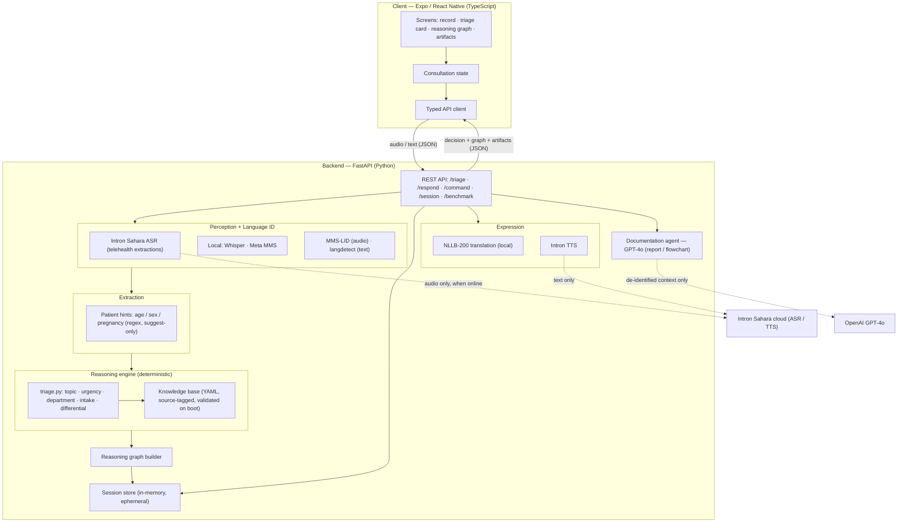

# Sauti Yetu — System Architecture & Technical Brief

**Project:** Sauti Yetu — multilingual (Swahili‑English first) voice triage decision support for primary healthcare
**Context:** Sahara CodeSwitch Africa Challenge 2026 (MLC Africa × Intron)
**Status:** Working prototype (hackathon scope)

> Decision support only — Sauti Yetu produces *hints* to aid clinical judgement. It is not a medical device and does not make diagnoses. See `RESPONSIBLE_AI.md` for the privacy, consent, and safety commitments.

---

## 1. What the system does

A patient walks up to a front desk or clinic and speaks a health complaint in their own language — often code‑switching between Swahili and English mid‑sentence ("Tumbo imekuwa ikiniuma *for 3 days*..."). Sauti Yetu:

1. **Listens** — captures the spoken complaint on a phone or laptop.
2. **Understands** — transcribes the code‑switched speech and extracts a structured clinical picture.
3. **Reasons** — turns that picture into an *action*: a triage topic, an urgency level, a department to route to, an auto‑filled intake card, and clarifying questions for the nurse.
4. **Explains** — every conclusion is traceable to a cited clinical source.
5. **Replies** — the health worker types in English; the patient hears and reads the reply in their own language.
6. **Documents** — a doctor can voice/type a command and get a structured report or flowchart of the consultation.

The whole thing is built so the clinician stays in control and only clinically relevant information ever moves between components.

---

## 2. High‑level architecture

```
┌───────────────────────────────────────────────────────────────────────┐
│                        CLIENT  (Expo / React Native, TS)               │
│   Screens: record → triage card → reasoning graph → artifacts           │
│   State: consultation context   ·   API client (typed)                  │
└───────────────▲───────────────────────────────────────────┬───────────┘
                │ audio (multipart)                           │ JSON
                │                                             ▼
┌───────────────┴───────────────────────────────────────────────────────┐
│                         BACKEND  (FastAPI, Python)                      │
│                                                                         │
│   /api/triage   /api/respond   /api/command   /api/session   /benchmark │
│        │             │              │              │                    │
│        ▼             ▼              ▼              ▼                    │
│  ┌───────────┐ ┌───────────┐ ┌───────────┐ ┌────────────────┐          │
│  │ Perception│ │Translation│ │ Doc agent │ │ Session store  │          │
│  │  + LID    │ │  + TTS    │ │ (GPT‑4o)  │ │ (in‑memory)    │          │
│  └─────┬─────┘ └─────┬─────┘ └─────┬─────┘ └───────┬────────┘          │
│        ▼             ▼             ▼               ▼                    │
│  ┌──────────────────────────────────────────────────────────┐         │
│  │  Reasoning engine (deterministic) over Knowledge Base      │         │
│  │  triage.py  ·  knowledge/triage_kb.yaml  ·  reasoning graph │         │
│  └──────────────────────────────────────────────────────────┘         │
└───────────────────────────────────────────────────────────────────────┘
        │ audio only, when online          │ (optional) text only
        ▼                                    ▼
  Intron Sahara ASR / TTS (commercial API)   OpenAI GPT‑4o (documentation)
  Local, key‑free models: Whisper · Meta MMS · NLLB‑200  (offline‑capable)
```

### Architecture diagram



Two design commitments shape everything:

- **Layered by responsibility.** Perception (speech → text), extraction (text → structure), reasoning (structure → decision), and expression (decision → reply/report) are separate. Each layer can be swapped, tested, and audited on its own.
- **Local‑first where it matters.** The models that touch the raw transcript for reasoning and translation run locally and need no API key, so the system degrades gracefully to an offline mode. Only speech‑to‑text/TTS and optional documentation reach an external API, and they receive the minimum needed.

---

## 3. Components and how they connect

### 3.1 Client — Expo / React Native (TypeScript)

Located in `app/`. A single codebase targeting web and mobile via `expo-router`.

- **Screens** (`app/src/app/`): `index` (record a complaint), `session/index` (triage card + timeline), `session/graph` (reasoning graph), `session/artifacts` (generated reports/flowcharts).
- **Components** (`app/src/components/`): `RecordSession`/`RecordControl` (capture), `ClinicalCard` (intake card + urgency), `DifferentialPanel` (ranked conditions), `ReasoningGraph`/`ReasoningTrace`/`ReasoningView` (explainability), `ProvenanceBadge` (source of each claim), `LanguageSelect`/`LanguageChips`, `ReplySheet` (worker reply + playback), `Timeline`.
- **Data layer**: `src/api/client.ts` (typed calls, platform‑aware audio upload) and `src/api/types.ts`. Client state lives in `src/state/consultation.tsx`; audio capture in `src/lib/audio*`.

The client only ever sends **audio** (for triage/command) or **short text** (for a reply), and renders back the structured decision. It holds no long‑term store of its own beyond the active consultation.

### 3.2 Backend — FastAPI (Python)

Located in `backend/`. The API surface (`app.py`):

| Endpoint | Purpose |
|---|---|
| `GET /api/languages` | Patient + doctor language lists |
| `GET /api/phrases` | Quick‑reply phrases translated to the patient language |
| `POST /api/session` · `GET /api/session/{id}` · `DELETE /api/session/{id}` | Start / read / **end** a consultation |
| `POST /api/triage` | Audio → detect language → transcribe/extract → triage decision + reasoning graph |
| `POST /api/respond` | Worker's English reply → translate → Intron TTS audio |
| `POST /api/command` | Doctor voice/text command → structured report or flowchart |
| `POST /api/benchmark` | Audio + reference transcript → 3‑model benchmark |

#### Perception layer

- `intron_client.py` — **Intron Sahara** synchronous speech‑to‑text with telehealth post‑processing. For triage it returns the transcript in the patient's language **plus English clinical extractions** (summary, entity list, differential, suggestions). Transport errors are normalised to a clean `IntronError` (e.g. TLS/DNS/timeout) rather than leaking a stack trace.
- `asr_models.py` — **local, key‑free** models, lazy‑loaded: OpenAI **Whisper** and **Meta MMS** (`mms-1b-all`) for transcription, and **MMS‑LID** for closed‑set language identification from audio. Also does the `ffmpeg` conversion to 16 kHz mono WAV and prepares phone formats (m4a/mp4/…) that the API can't ingest directly.
- `lid.py` — text‑side language identification over the transcript, used to refine an `auto` language choice.

#### Extraction layer

- `extract.py` — deterministic **regex** extraction of patient context (age, sex, pregnancy) from the transcript/summary. It only ever *suggests*: explicit clinician input always wins, and any auto‑filled field is flagged `auto_detected` for confirmation. No model, no key.

#### Reasoning layer (the "agentic" core)

- `knowledge/triage_kb.yaml` + `knowledge_base.py` — the clinical knowledge expressed as **reviewable, source‑tagged data**, not code: topics → department + urgency, WHO IITT acuity discriminators, naive‑Bayes condition findings, and age‑banded vital‑sign thresholds. It is loaded and **validated on boot** (a malformed KB fails fast). Every assertion carries a `source` block (`evidence_level`, `review_status`, `mapped_scale`, `ref`, `url`).
- `triage.py` — a **deterministic reasoning engine** over the KB. It scans the English extractions + transcript for topic keywords, ranks matched topics by acuity then weight of evidence, and **derives** urgency: discriminators and entered vitals can only *escalate* (safety‑first), each keeping its citation. It emits the triage topic, urgency, department, an auto‑filled intake card, clarifying questions, a ranked+cited differential, matched red flags, and full provenance. Deterministic on purpose: reproducible, auditable, and no hidden model in the decision path.

#### Expression layer

- `translator.py` — **local NLLB‑200** (`distilled-600M`), key‑free. Translates the English worker reply into the patient language before TTS, and the patient transcript/intake into the doctor's language. Falls back to passthrough for English/Pidgin and unknown pairs.
- `tts_client.py` — **Intron TTS**: renders the reply as audio in the patient's language/voice.
- `phrases.py` — a bank of pre‑translated quick‑reply phrases (cached, so common replies need no live translation call).

#### Documentation agent

- `agent.py` — a doctor voice/text command (`/api/command`) is turned into a structured **markdown report or Mermaid flowchart** by **OpenAI GPT‑4o**, constrained by a strict system prompt: it must open every artifact with a "decision support only" disclaimer, may not invent symptoms/vitals/conditions beyond the session context, keeps EMERGENCY red flags as‑is, and writes in the doctor's language. It receives only the accumulated session context, never raw audio.

#### Session & reasoning graph

- `graph.py` — builds a per‑turn **graph delta** (nodes/edges) from the triage result: complaint → findings → topic → urgency → red flags, each carrying provenance.
- `graph_store.py` — an **in‑memory, process‑local** session store. One session = one consultation. It dedups graph elements, keeps turn history for the documentation agent, and holds generated artifacts. **Non‑persistent and no TTL by design** — a restart clears everything, and `DELETE /api/session/{id}` ends a consultation immediately.

#### Evaluation harness

- `benchmark.py` + `scripts/generate_primary_report.py` + `scripts/generate_benchmark_report.py` — reproducible WER/CER, real‑time factor, code‑switch switch‑point WER, downstream agentic accuracy, noise robustness (SNR sweep), and an offline (local‑only) pass. Runs score all models against **human ground‑truth transcripts** in `metadata.csv`.

### 3.3 External services

- **Intron Sahara** (ASR + TTS) — commercial API, African‑accent and code‑switch optimised. Receives **only the audio** needed for the task.
- **OpenAI GPT‑4o** — optional, documentation only. Receives **only the doctor‑facing session context** (already de‑identified structure), never raw audio.

Both are optional to the core loop: with no keys, the local Whisper/MMS/NLLB stack keeps transcription, reasoning, and translation working offline (the documentation agent and TTS are the only features that hard‑require a key).

---

## 4. End‑to‑end request flow (a triage turn)

```
Patient speaks
   │
   ▼  POST /api/triage  (audio + optional patient context: age/sex/vitals)
[1] prepare_for_intron → 16 kHz WAV
[2] language resolution
      auto?  →  MMS‑LID on audio  +  langdetect on transcript  →  final code
[3] Intron Sahara telehealth  →  patient‑language transcript
                                +  English extractions (summary, entities, ddx)
[4] extract.py  →  age/sex/pregnancy HINTS (explicit clinician input wins)
[5] run_triage (deterministic, over KB)
      keyword evidence → ranked topic
      discriminators + entered vitals → DERIVED urgency (escalate‑only)
      → topic · urgency · department · intake card · questions · differential
        · red flags · provenance
[6] translator (local NLLB) → doctor‑language transcript + intake
[7] graph delta appended to in‑memory session
   │
   ▼  JSON: transcript (patient+doctor), triage decision, reasoning graph, artifacts
Client renders the clinical card, urgency, differential, and cited reasoning.
```

### Triage turn as a sequence

```mermaid
sequenceDiagram
  actor P as Patient
  participant C as Client app
  participant API as FastAPI /api/triage
  participant ASR as Intron Sahara (+ local Whisper/MMS)
  participant EX as extract.py (regex)
  participant TR as triage.py + Knowledge Base
  participant TL as NLLB (local)
  participant S as Session store (ephemeral)

  P->>C: Speak complaint (code-switched)
  C->>API: POST audio (+ optional age/sex/vitals)
  API->>API: Convert to 16 kHz WAV
  API->>ASR: Transcribe + extract (if auto: MMS-LID + langdetect)
  ASR-->>API: Patient transcript + English extractions
  API->>EX: Extract age/sex/pregnancy hints (suggest-only)
  API->>TR: run_triage(extractions, patient context)
  TR-->>API: topic · urgency (escalate-only) · dept · intake · differential · provenance
  API->>TL: Translate transcript + intake to doctor language
  API->>S: Append reasoning-graph delta
  API-->>C: Decision + reasoning graph + artifacts (JSON)
  C-->>P: Show transcript; clinician reviews the hints
```

**Reply flow** (`/api/respond`): worker types English → NLLB translates to patient language (or cache hit) → Intron TTS → base64 audio returned and played to the patient.

**Documentation flow** (`/api/command`): doctor speaks/types a command → (optional) transcribe → GPT‑4o over session context → report/flowchart artifact stored on the session.

---

## 5. Data handling and minimisation (summary)

Sauti Yetu is deliberately built so that **each component receives only what it needs** and nothing is retained longer than the consultation:

- **Audio** is converted, used for transcription, and **not persisted**; temporary WAV files are deleted after use.
- **Only clinically relevant structure** flows downstream. The reasoning engine and the documentation agent work over the extracted summary/entities/decision — not over identity data. Patient context (age/sex/vitals) is optional and, when present, is treated as clinical signal only.
- **Vitals are never inferred from audio** — they are only evaluated when a clinician actually enters them.
- **The session store is in‑memory and ephemeral**, with an explicit end‑session (`DELETE`) and no persistence across restarts.
- **External calls are minimised**: audio to Intron only when online; de‑identified session context to GPT‑4o only when documentation is requested.

The full privacy, consent, safety, and responsible‑data‑use commitments — and how each was achieved in this codebase — are documented separately in **`RESPONSIBLE_AI.md`**.

---

## 6. Technology stack

| Layer | Technology |
|---|---|
| Client | Expo / React Native, TypeScript, expo-router |
| Backend | FastAPI, Python 3, Uvicorn |
| Speech‑to‑text | Intron Sahara (API) · OpenAI Whisper · Meta MMS (local) |
| Language ID | MMS‑LID (audio) · langdetect (text) |
| Translation | NLLB‑200 distilled‑600M (local) |
| Text‑to‑speech | Intron TTS |
| Reasoning | Deterministic engine over a YAML clinical knowledge base |
| Documentation agent | OpenAI GPT‑4o (structured JSON output) |
| Evaluation | jiwer (WER/CER), matplotlib + fpdf2 (reports) |
| Audio tooling | ffmpeg (16 kHz mono WAV normalisation) |

---

## 7. Design principles recap

1. **Hints, not decisions.** The clinician is always in the loop; the system escalates conservatively and never under‑triages silently (unknown → hand off to a human).
2. **Explainable by construction.** Every conclusion carries a cited source; the reasoning graph makes the path from complaint to decision visible.
3. **Deterministic where safety matters.** The triage decision is reproducible and auditable; the only generative model (GPT‑4o) is confined to documentation with strict guardrails.
4. **Local‑first and offline‑capable.** Key‑free local models keep the core loop working without sending data off the device.
5. **Data minimisation everywhere.** Components receive only what they need; nothing persists beyond the consultation.
